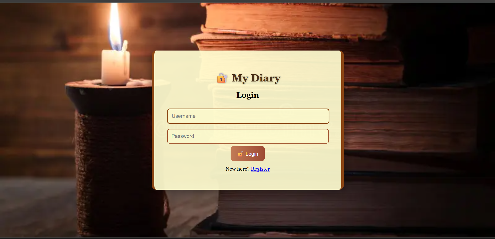
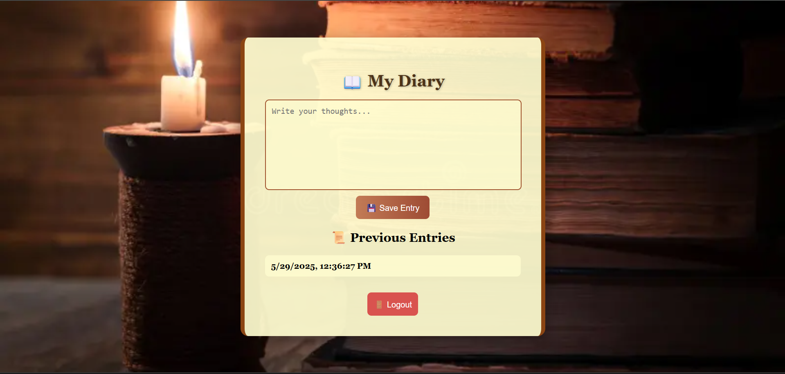

# 📖 Personal Diary Web App

A simple and elegant personal diary web application built with HTML, CSS, and JavaScript. Users can register, log in, write their thoughts, and view saved entries — all in a beautiful book-themed UI.

---

## 🌟 Features

- 📝 Register and log in with credentials
- 💬 Create, view, and delete diary entries
- 🪄 Smooth transitions and animations
- 📱 Fully responsive for mobile and desktop
- 🎨 Styled with a classic book-like interface

---

## 🛠️ Tech Stack

- **Frontend**: HTML, CSS (custom), JavaScript
- **Design**: Book-inspired theme with handwritten-like font
- **Responsive**: Mobile-first design with media queries

---

## 🚀 How to Run Locally

1. **Clone this repository:**
   ```bash
   git clone https://github.com/yourusername/diary-app.git
   cd diary-app
## 📸 Screenshots

### 💻 login View



### 📱 Diary View


